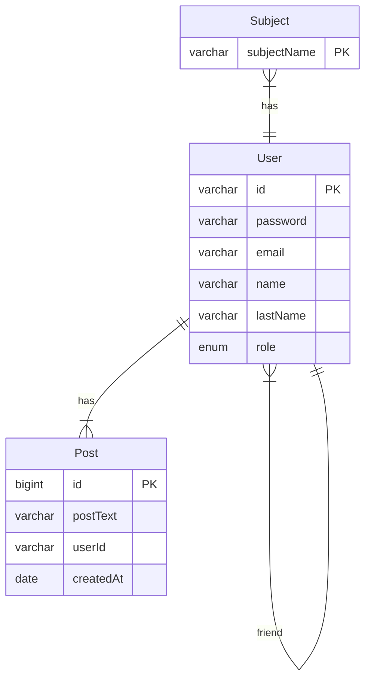

# tsn-back

```mermaid
erDiagram
    User{
        varchar id PK
        varchar password
        varchar email
        varchar name
        varchar lastName
        enum role
    }

    Post{
        bigint id PK
        varchar postText
        varchar userId
        date createdAt
    
    }

    Subject{
        varchar subjectName PK
    }


    User }|--|| User:friend

    User ||--|{ Post:has

    Subject }|--|| User:has
```